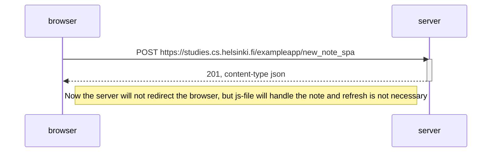

```mermaid
sequenceDiagram
    participant browser
    participant server
    
    browser->>server: POST https://studies.cs.helsinki.fi/exampleapp/new_note_spa
    activate server
    server-->>browser: 201, content-type json
    deactivate server
    
    Note right of browser: Now the server will not redirect the browser, but js-file will handle the note and refresh is not necessary

```
